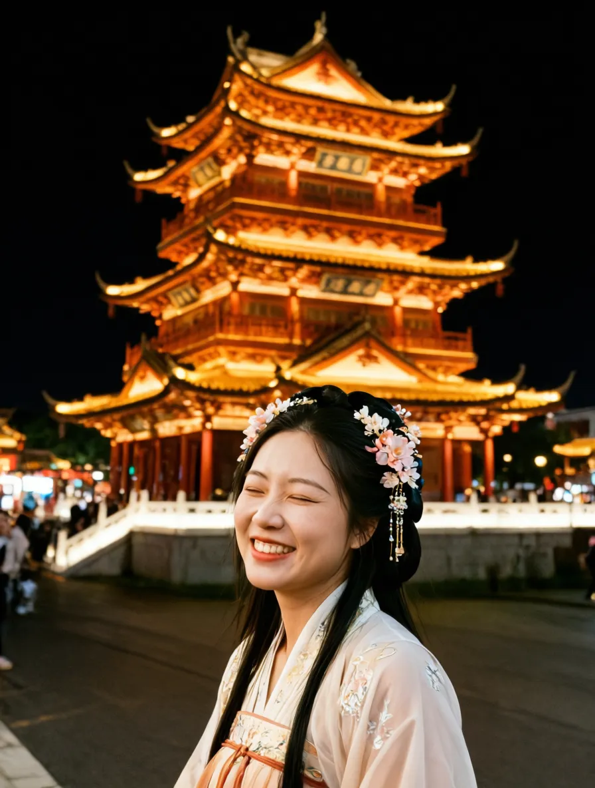

<table align="center">
  <tr>
    <td align="center"> input</td>
    <td align="center"> our result</td>
  </tr>
  <tr>
    <td colspan="2" align="center">将背景换为带自然光效的浅蓝色，身穿浅米色蕾丝领上衣，将发型改为右侧佩戴精致珍珠发夹，同时单手向前抬起握着一把宝剑，另一只手自然摆放。面部微笑。</td>
  </tr>
  <tr>
    <td align="center"> input</td>
    <td align="center"> our result</td>
  </tr>
  <tr>
    <td colspan="2" align="center">替换背景为盛开的樱花树场景；更换衣服为黑色西装，为人物添加单肩蓝色书包，单手抓住包带。头发变为高马尾。色调明亮。蹲下。</td>
  </tr>
  <tr>
    <td align="center"> input</td>
    <td align="center"> our result</td>
  </tr>
  <tr>
    <td colspan="2" align="center">改变背景为粉色，移除所有竹叶；将人物姿态改为趴在粉色毛绒篮子内，双手撑在下巴下，头部和身体正对镜头，人物位于画面中心，眼神看向前方；更换帽子为带有粉色花朵和粉色耳朵的发带；更换服装为米色毛绒衣物；移除熊猫玩偶；调整面部表情为张嘴笑</td>
  </tr>
  <tr>
    <td align="center"> input</td>
    <td align="center"> our result</td>
  </tr>
  <tr>
    <td colspan="2" align="center">将背景替换为室外湖泊和树木场景；人物身体正向镜头，头部略微偏向画面的左侧，双臂交叉并用右手以及左胳肢窝抱持一个红色小鼓；拉近相机视角。</td>
  </tr>
  <tr>
    <td align="center"> input</td>
    <td align="center"> our result</td>
  </tr>
  <tr>
    <td colspan="2" align="center">替换背景为户外场景（包含现代建筑、绿树、水池、金属栏杆）；调整人物为站姿，双手自然下垂</td>
  </tr>
  <tr>
    <td align="center"> input</td>
    <td align="center"> our result</td>
  </tr>
  <tr>
    <td colspan="2" align="center">替换背景为带有白色墙面、镜子、木质装饰和红色袋子的室内环境；将人物穿着改为浅蓝色衬衫和条纹长裤；为人物添加红色肩带、白色帆布包（包上有红色标志）；调整人物姿态使其身体侧向画面的右侧；头部略微向画面右侧倾斜；双手手持一束粉色和白色玫瑰（带有绿色叶子和白色丝带）以及一部手机；拉远相机视角</td>
  </tr>
  <tr>
    <td align="center"> input</td>
    <td align="center"> our result</td>
  </tr>
  <tr>
    <td colspan="2" align="center">替换背景为米色墙面的室内场景；将人物服装改为黑色无袖连衣裙，并在左肩上搭一件黑色外套，左手抬起弯曲拉住外套，右手自然下垂；更改发型为盘发并移除花环头饰；移除手链；调整人物姿态为转向画面左侧站立，头部回望，眼神看向镜头，轻微张嘴微笑，为人物添加金色大耳环。调整整体光线为更暗的室内光。</td>
  </tr>
  <tr>
    <td align="center"> input</td>
    <td align="center"> our result</td>
  </tr>
  <tr>
    <td colspan="2" align="center">将背景替换为室内展示环境（含玻璃展示柜与浅色墙面）；调整相机视角为近景，聚焦人物上半身；改变人物姿态为身体朝向画面左前方侧身站立，双手捧持一个黑色方形物品；更换服装为黑色短袖上衣和白色裤子；移除耳环；调整面部朝向为低头看手中物品，表情为微笑。调整全局色调为冷色调</td>
  </tr>
  <tr>
    <td align="center"> input</td>
    <td align="center"> our result</td>
  </tr>
  <tr>
    <td colspan="2" align="center">拉近镜头，调整视角为半身特写视角；将人物姿态从蹲坐姿势改为站立姿势，调整手臂动作使一只手举过头顶、一只手手放在肩胛骨处；更换手镯为宽版金色手镯，头部脸部正向镜头</td>
  </tr>
  <tr>
    <td align="center"> input</td>
    <td align="center"> our result</td>
  </tr>
  <tr>
    <td colspan="2" align="center">将头饰换成簪花 衣服更改为汉服 背景更换为夜晚亮灯中式钟楼 去掉背景里的人</td>
  </tr>
</table>
